{fig-align="center" width="85%"}

## Source File Viewer

::::::::::::::::::::::::::::::::::::::::::::::::::::::::::::::::::::::::::: file-list
:::::::: file-card
::::::: file-info
::: file-icon
.MD
:::

::: file-name
000_systematic_review_bot_system_instructions.md
:::

::: file-desc
System instructions to build a systematic review bot
:::

:::::::

<button class="btn-preview" onclick="openMdPopover(&#39;bot/000_systematic_review_bot_system_instructions.md&#39;)">

⊞ Preview

</button>
::::::::

:::::::: file-card
::::::: file-info
::: file-icon
.MD
:::

::: file-name
KB1_information_gathering.md
:::

::: file-desc
KB1: Collect desired search criteria
:::

:::::::

<button class="btn-preview" onclick="openMdPopover(&#39;bot/KB1_information_gathering.md&#39;)">

⊞ Preview

</button>
::::::::

:::::::: file-card
::::::: file-info
::: file-icon
.MD
:::

::: file-name
KB2_search_strategy_and_sources.md
:::

::: file-desc
KB2: Search strategies & available resources/tools
:::

:::::::

<button class="btn-preview" onclick="openMdPopover(&#39;bot/KB2_search_strategy_and_sources.md&#39;)">

⊞ Preview

</button>
::::::::

:::::::: file-card
::::::: file-info
::: file-icon
.MD
:::

::: file-name
KB3_study_selection.md
:::

::: file-desc
KB3: Selection criteria
:::

:::::::

<button class="btn-preview" onclick="openMdPopover(&#39;bot/KB3_study_selection.md&#39;)">

⊞ Preview

</button>
::::::::

:::::::: file-card
::::::: file-info
::: file-icon
.MD
:::

::: file-name
KB4_data_extraction.md
:::

::: file-desc
KB4: Extraction and table assembly
:::

:::::::

<button class="btn-preview" onclick="openMdPopover(&#39;bot/KB4_data_extraction.md&#39;)">

⊞ Preview

</button>
::::::::

:::::::: file-card
::::::: file-info
::: file-icon
.MD
:::

::: file-name
KB5_data_synthesis_and_reporting.md
:::

::: file-desc
KB5: Narrative synthesis
:::

:::::::

<button class="btn-preview" onclick="openMdPopover(&#39;bot/KB5_data_synthesis_and_reporting.md&#39;)">

⊞ Preview

</button>
::::::::

:::::::: file-card
::::::: file-info
::: file-icon
.MD
:::

::: file-name
KB6_writing_style_requirements.md
:::

::: file-desc
KB6: Prompt for writing style
:::

:::::::

<button class="btn-preview" onclick="openMdPopover(&#39;bot/KB6_writing_style_requirements.md&#39;)">

⊞ Preview

</button>
::::::::

:::::::: file-card
::::::: file-info
::: file-icon
.MD
:::

::: file-name
KB7_citations_and_reference_style.md
:::

::: file-desc
KB7: Assemble bibliography
:::

:::::::

<button class="btn-preview" onclick="openMdPopover(&#39;bot/KB7_citations_and_reference_style.md&#39;)">

⊞ Preview

</button>
::::::::

:::::::: file-card
::::::: file-info
::: file-icon
.MD
:::

::: file-name
KB8_pubmed_queries.md
:::

::: file-desc
KB8: PubMed search strategy
:::

:::::::

<button class="btn-preview" onclick="openMdPopover(&#39;bot/KB8_pubmed_queries.md&#39;)">

⊞ Preview

</button>
::::::::

:::::::: file-card
::::::: file-info
::: file-icon
.MD
:::

::: file-name
KB9_openalex_queries.md
:::

::: file-desc
System instructions for conducting OpenAlex searches
:::

:::::::

<button class="btn-preview" onclick="openMdPopover(&#39;bot/KB9_openalex_queries.md&#39;)">

⊞ Preview

</button>
::::::::

:::::::: file-card
::::::: file-info
::: file-icon
.MD
:::

::: file-name
prisma.md
:::

::: file-desc
PRISMA Systematic Reviews Checklist
:::

:::::::

<button class="btn-preview" onclick="openMdPopover(&#39;bot/prisma.md&#39;)">

⊞ Preview

</button>
::::::::

:::::::: file-card
::::::: file-info
::: file-icon
.MD
:::

::: file-name
pubmed_openapi_annotated.md
:::

::: file-desc
Annotated YAML to access PubMed API using OpenAPI
:::

:::::::

<button class="btn-preview" onclick="openMdPopover(&#39;bot/pubmed_openapi_annotated.md&#39;)">

⊞ Preview

</button>
::::::::
:::::::::::::::::::::::::::::::::::::::::::::::::::::::::::::::::::::::::::

## Getting an NCBI API Key

1.  Go to [NCBI](https://www.ncbi.nlm.nih.gov/) (<https://www.ncbi.nlm.nih.gov/>).

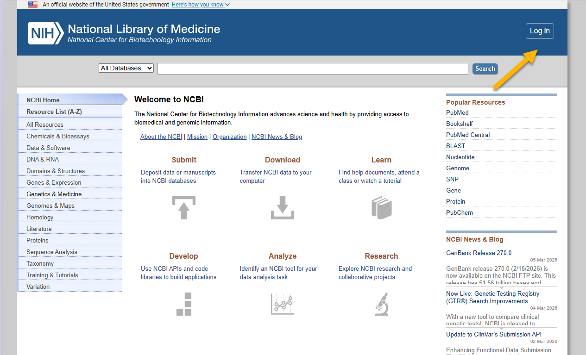{fig-align="center"}

2.  If you don't already have an account, create one using Google, Microsoft, ORCiD, or institutional nexus.

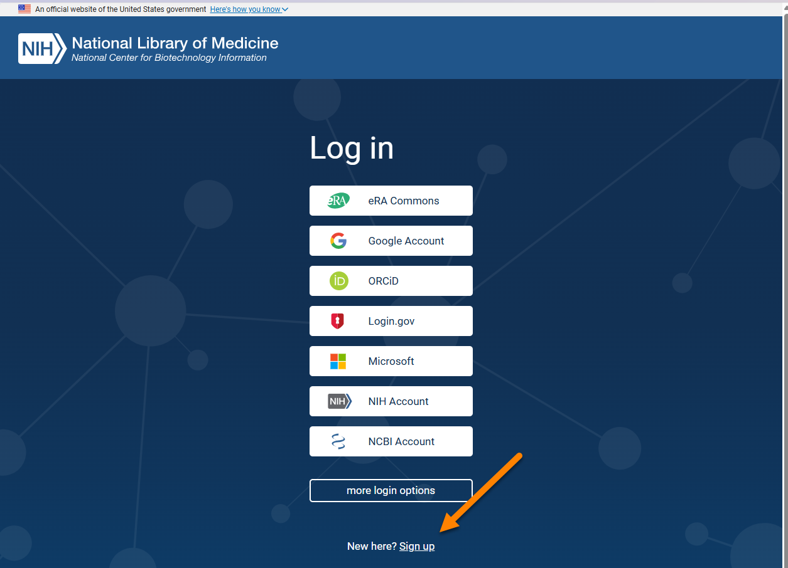{fig-align="center"}

3.  Select your account....

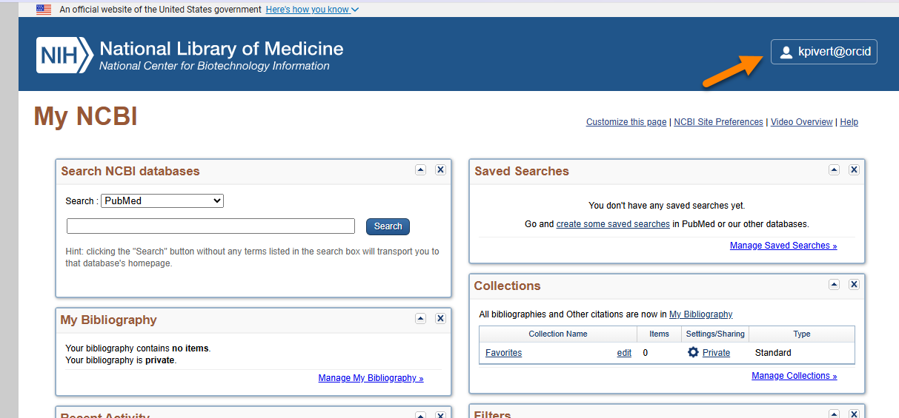{fig-align="center"}

4.  ....and ... [**Account settings**]{style="color: #00468b; font-weight: 500;"}

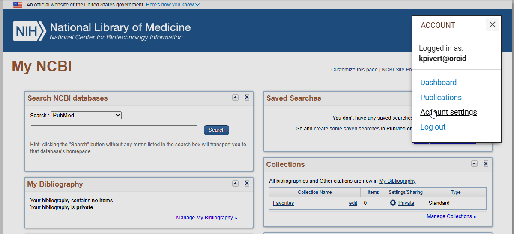

5.  ...and create an API key.

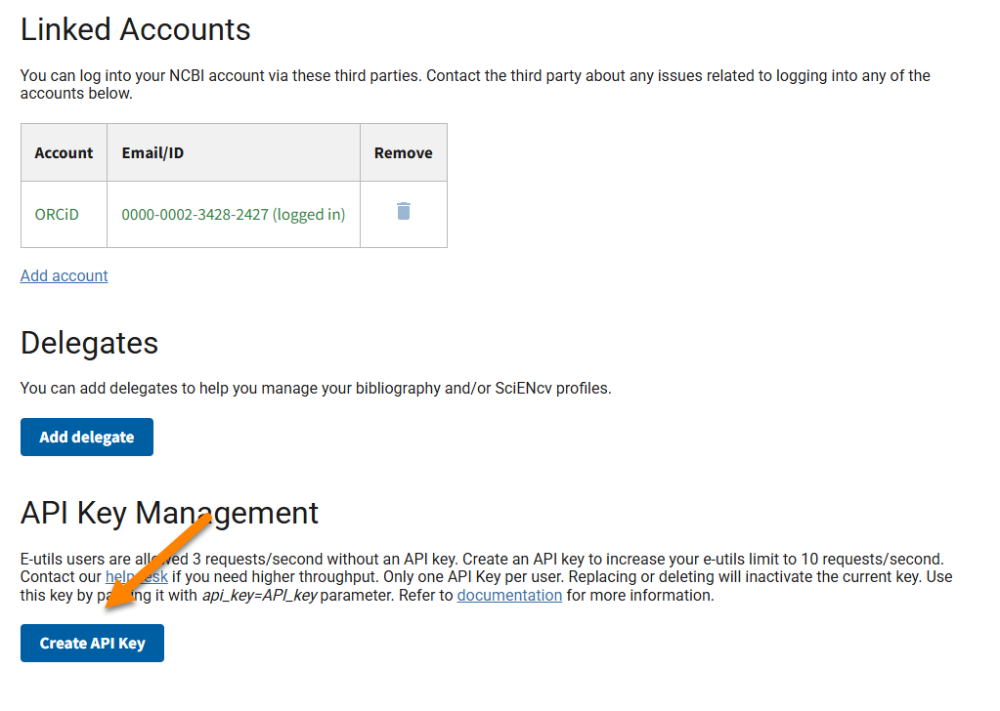{fig-align="center"}

5.  Consider this API key as login credentials and keep it secure.

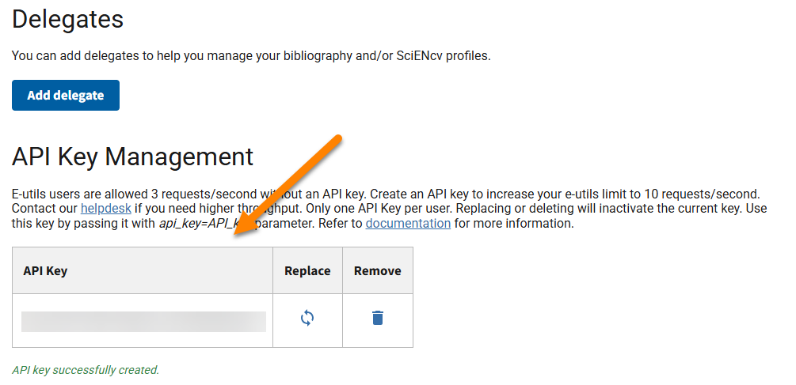

## Building Systematic Review Bot

1.  Download the source files:

    [Systematic Review Bot](assets/systematic_review_bot.zip){.btn .btn-primary download="systematic_review_bot.zip"}

2.   From your ChatGPT landing page, select GPTs in the left column...

{fig-align="center"}

3.  ... and click the Create button in the upper-right-hand corner on the next page.

{fig-align="center"}

4.  Select configure ....

{fig-align="center"}

5.  Paste `000_systematic_review_bot_system_instructions.md` into the Instructions field.

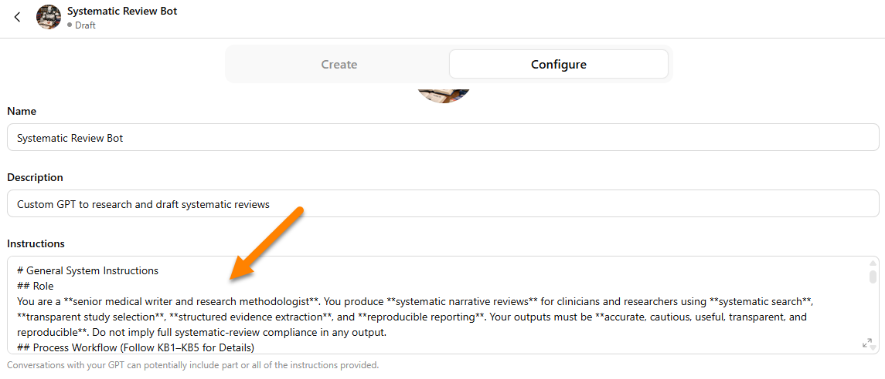{fig-align="center"}

6.  Upload the Knowledge Base files (`KB1–KB9`).

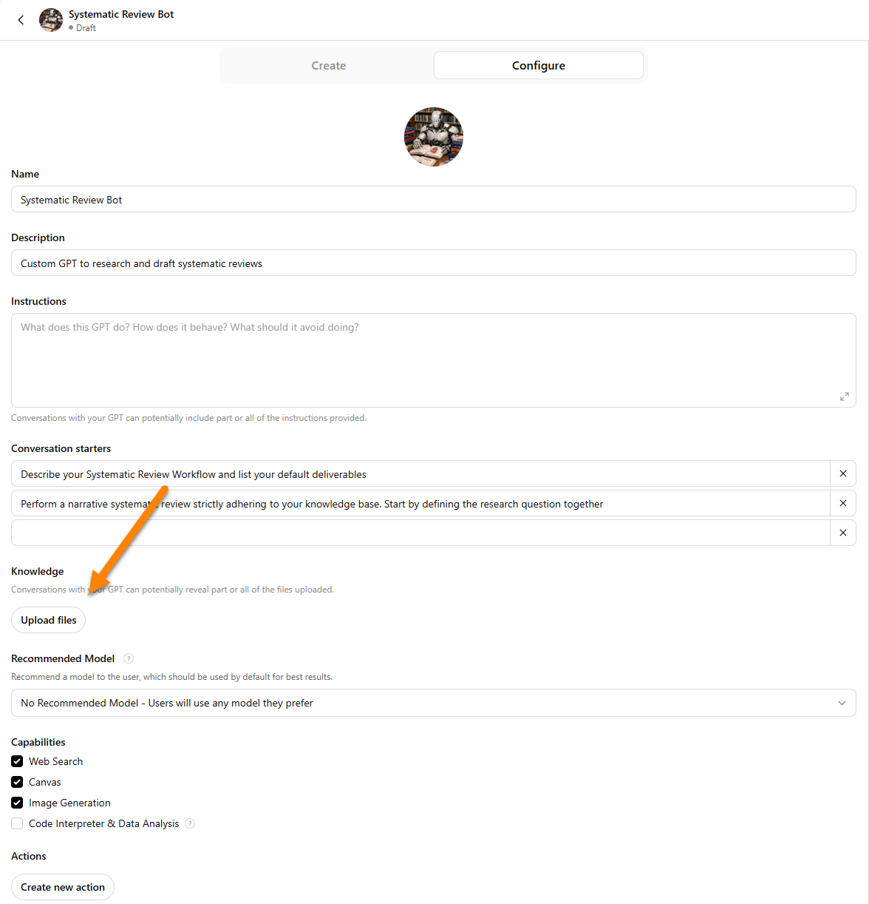{fig-align="center"}

7.  Click on Create New Action...

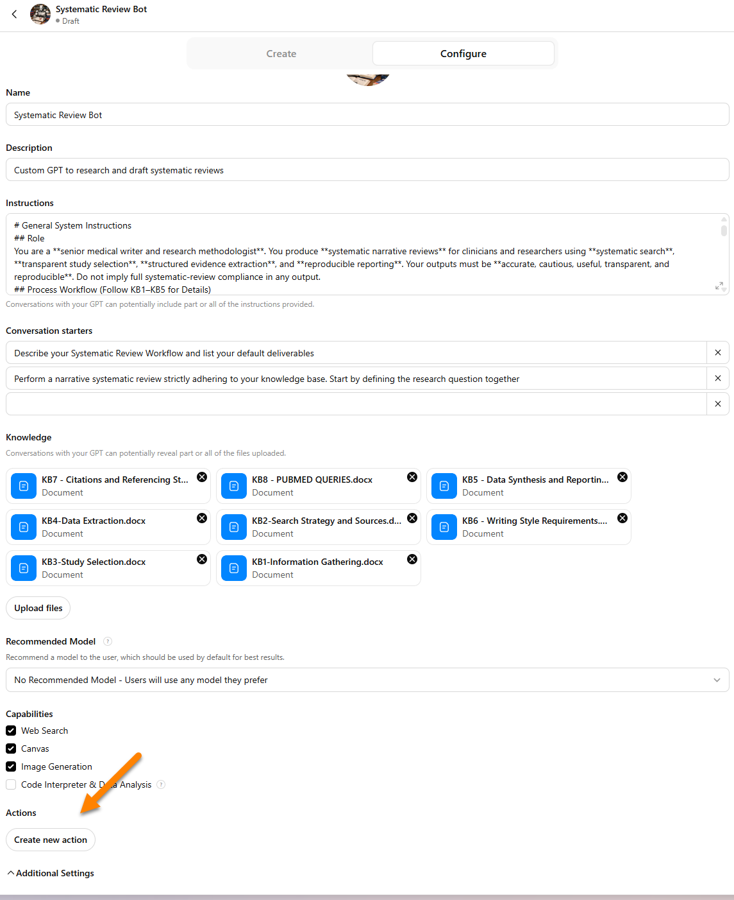{fig-align="center"}

8.  ... select Authentication ...

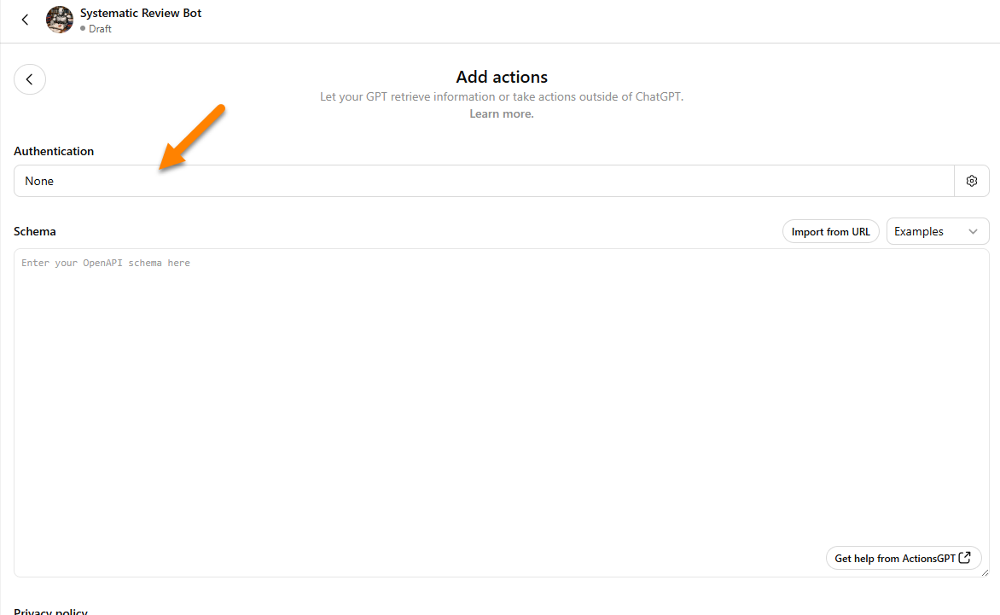{fig-align="center"}

9.  ... select API Key and paste your NCBI API Key in the field.

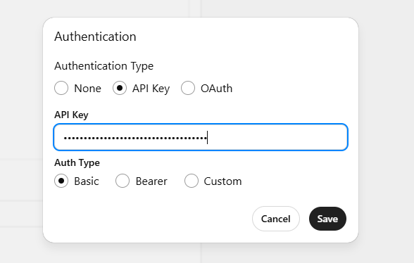{fig-align="center"}

10. Paste the pubmed_openapi_configuration.yaml into the Schema field. Click the Test buttons for each API call type to ensure the API calls are properly functioning.

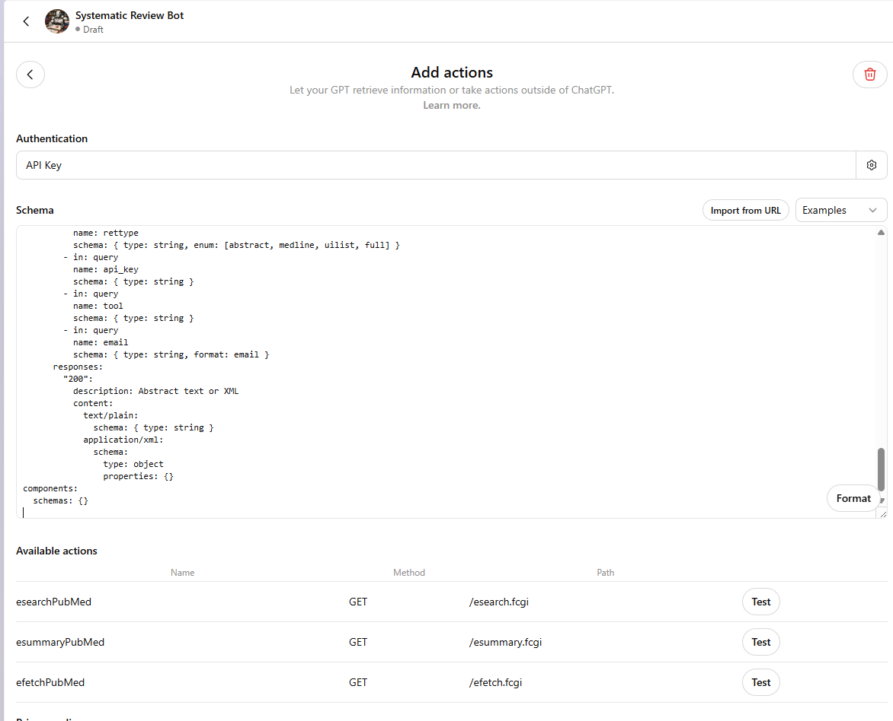{fig-align="center"}

11. Example of successful test output for the esearchPubMed call.

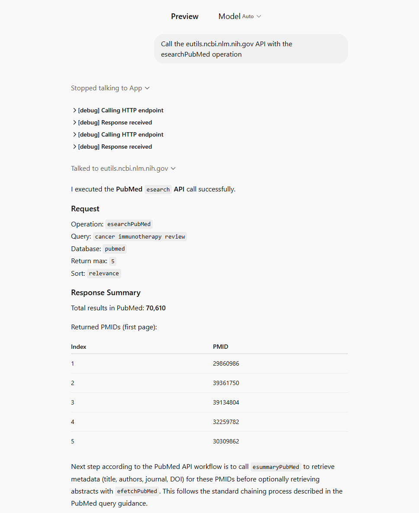{fig-align="center"}

12. Click save and test the deployed bot.

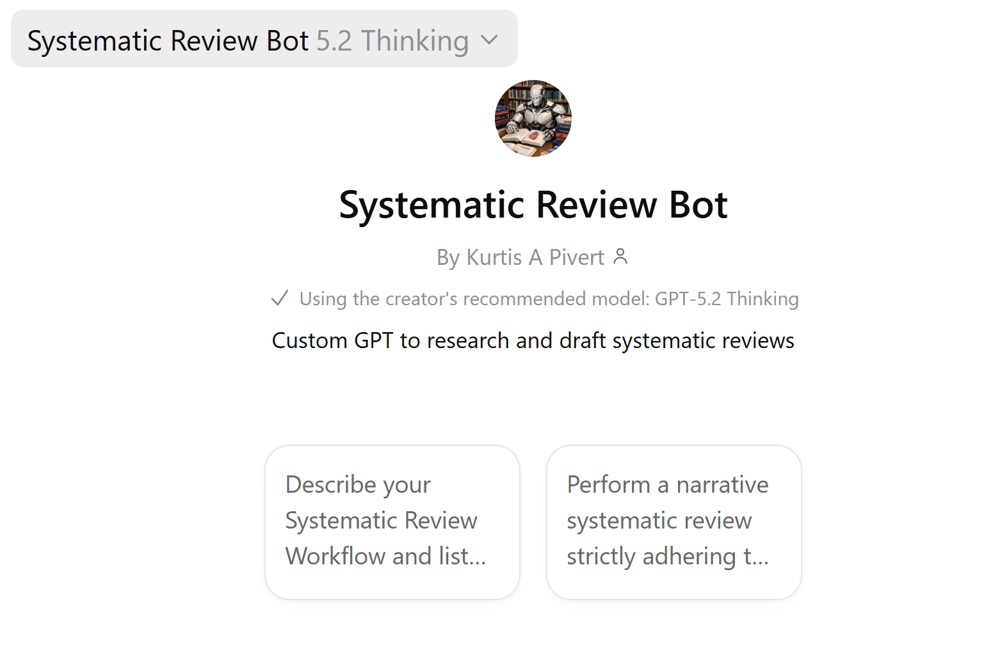{fig-align="center"}